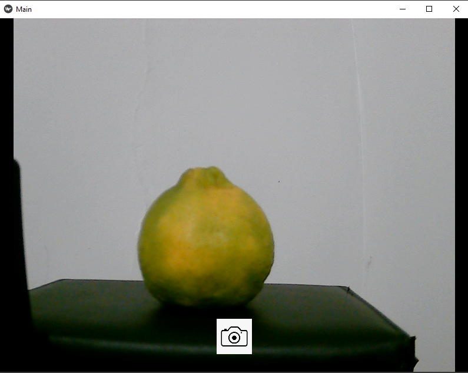
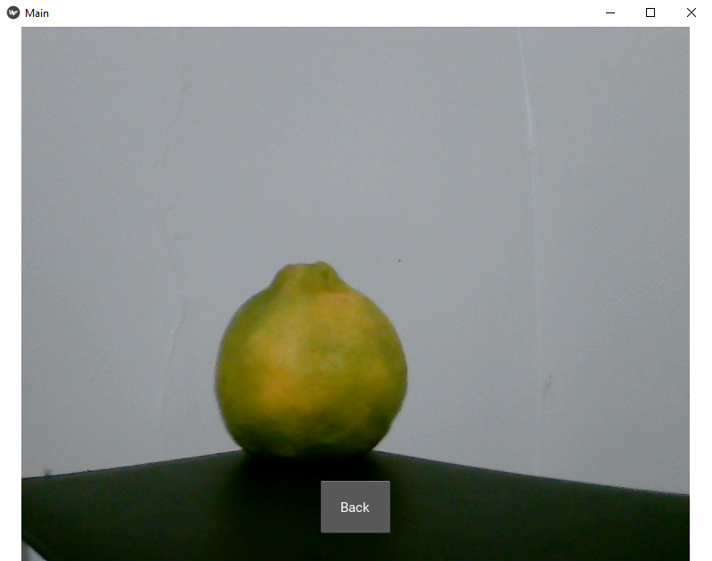

# Protótipo - Kivy

Protótipo de aplicativo feito em Kivy, resultado do instruction sobre desenvolvimento mobile.
Grupo: Auxílio na tomada de decisão no processo de compra de frutas e vegetais.

## Introdução

Para alcançar o nosso objetivo, precisamos obter o conhecimento necessário para o desenvolvimento de um aplicativo mobile. Como primeiro passo na nossa jornada, decidimos criar um app simples que acesse a câmera e a galeria de um celular. Com isso em mente, escolhemos dois frameworks para o nosso estudo sobre desenvolvimento mobile:
+ Flutter (Dart)
+ Kivy (Python)

Este repositório contém o código do protótipo do nosso aplicativo feito em Kivy, assim como um guia para auxiliar aqueles que estão dando os seus primeiros passos com o framework.

### O que é Kivy?

Como é dito na [página inicial](https://kivy.org/) da ferramenta que dá acesso à documentação:

O kivy é um framework de código aberto baseado na linguagem python, que é uma das principais linguagens para desenvolvimento de softwares envolvendo machine learning e ciência de dados. Um dos principais atrativos do framework é que ele é multiplataforma, ou seja, uma única aplicação é necessária para rodas em diversos sistemas operacionais, como: Android, iOS, desktop, entre outros; além de ser bem flexível e simples no desenvolvimento das aplicações.

  
## Como instalar o Kivy e rodar seu primeiro projeto.

A instalação do Kivy é simples, pois trata-se de uma biblioteca python que pode ser instalada através do pip. Ademais, para funcionar corretamente, é necessário a instalação de algumas bibliotecas suplementares.

Para isso, criamos o tutorial no link a seguir para a instalação e criação de um aplicativo simples utilizando o PyCharm. [Tutorial Kivy](tutorial-kivy.md).

## Entendendo conceitos fundamentais do Kivy:

Em um aplicativo utilizando o Kivy, no geral toda a lógica e a parte da programação em si fica em arquivos .py, enquanto os layouts e os widgets ficam em arquivos .kv, embora possa haver intercâmbios entre eles para necessidades específicas. Somado a isso, praticamente todos os elementos que dizem respeito ao kivy são *widgets*, então a manipulação desses é fundamental para a construção dos aplicativos. Existe uma quantidade muito grande de widgets, onde alguns dos principais são: Button, Label, Text Input, Check box, Image.

Para acesso a todos: [widgets - Kivy](https://kivy.org/doc/stable/api-kivy.uix.html).

## Nosso Aplicativo

[Processo explicativo da construção do app.](processo_explicativo.ipynb)

Como dito anteriormente, nosso objetivo era criar um protótipo de um app simples acessar a câmera e registrar uma imagem que será exibida na tela. O código fonte deste protótipo pode ser encontrado neste repositório, com comentários que facilitam o seu entendimento.

### Preview no desktop

Prints da tela do computador onde foi usada uma webcam para capturá-las.

         

### Outros links úteis:
+ [Kivy](https://kivy.org/doc/stable/) - Um dos links principais é a documentação oficial do próprio kivy, onde há informações diversas sobre instalação, componentes e também aplicativos de exemplo muito úteis para consulta.
+ [Conceitos básicos do kivy](https://www.youtube.com/watch?v=9JH8r8mz0g4&ab_channel=Zenva) - Um vídeo tutorial do canal no youtube Zenva que apresenta os conceitos básicos e aplicativos simples com o kivy utilizando seus principais dois tipos de layout: FloatLayout e GridLayout.

