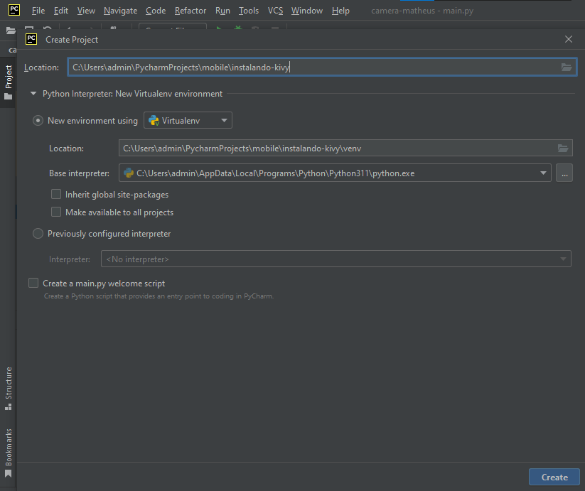
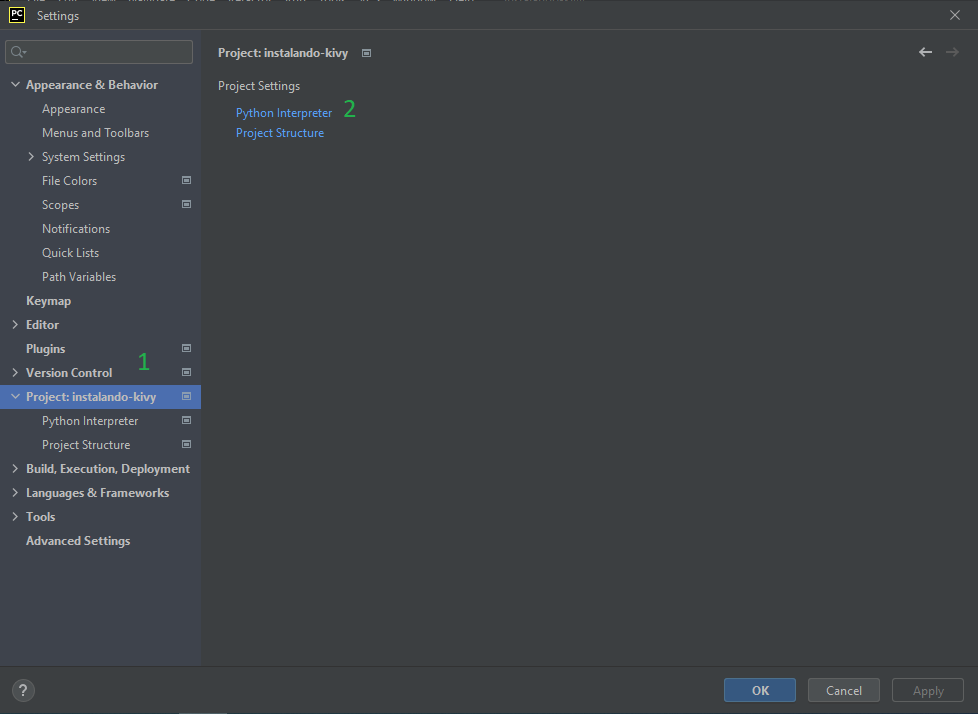
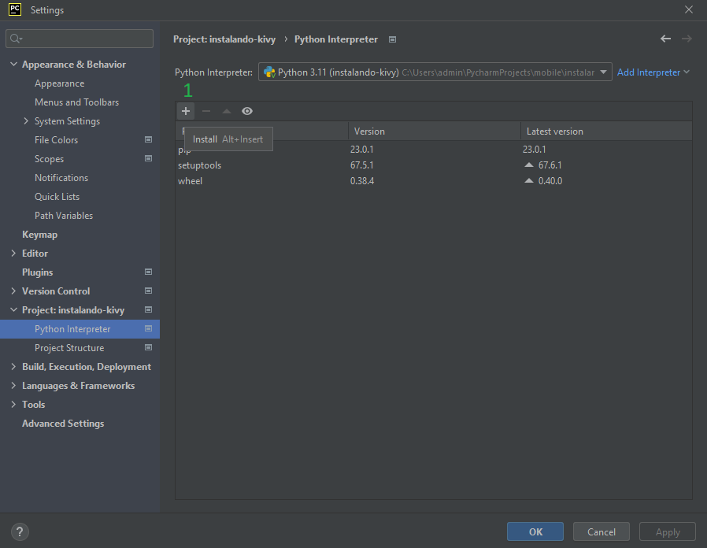
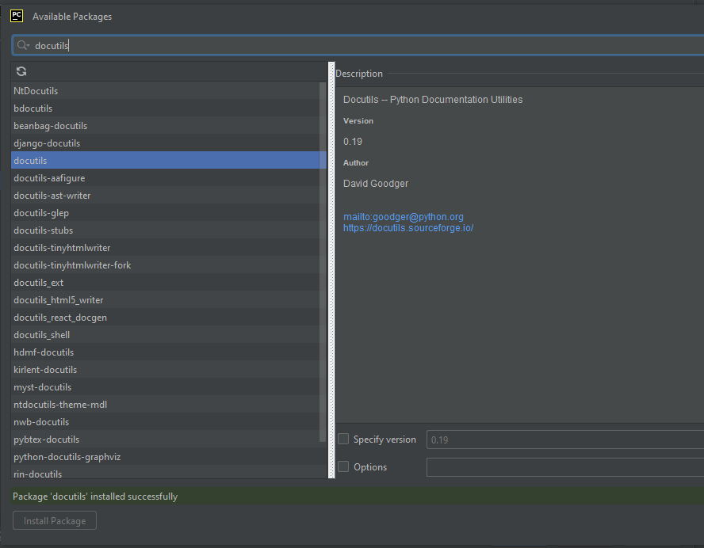
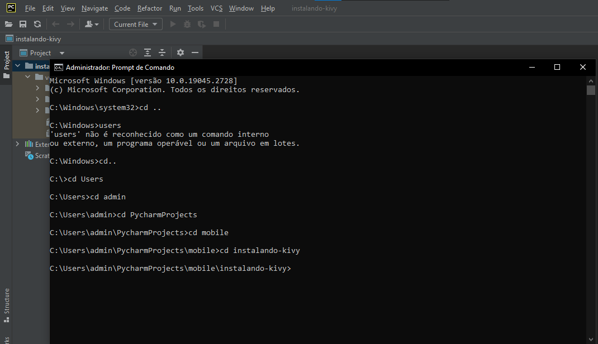
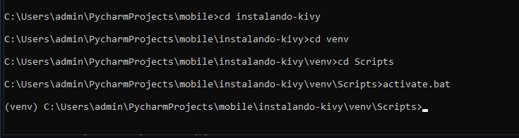
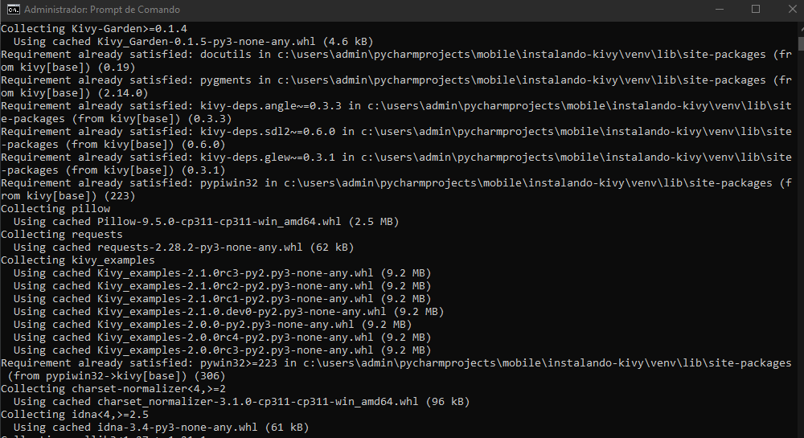
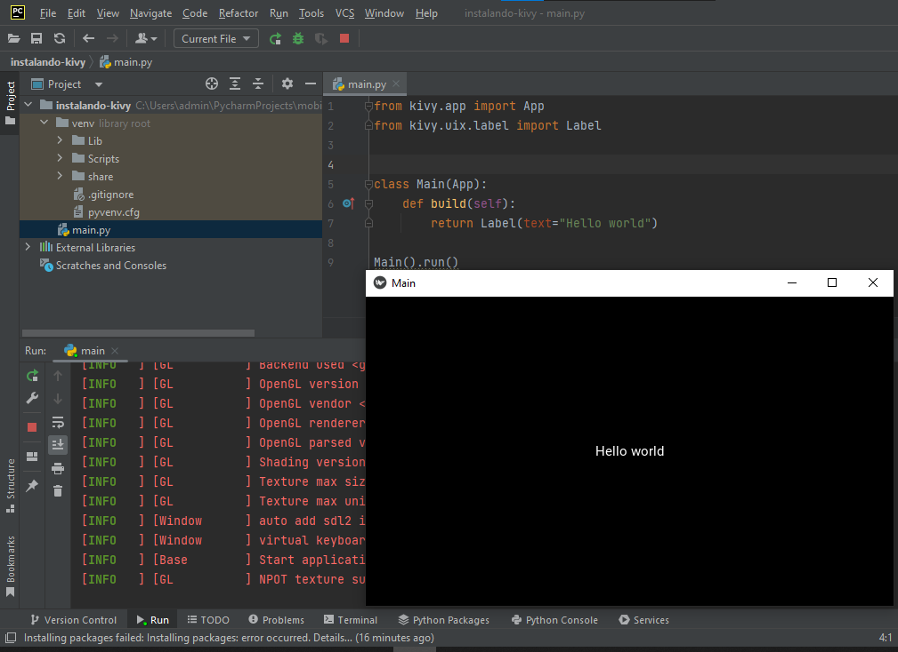

# Protótipo Kivy 
Descrição do processo de criação de um aplicativo utilizando a biblioteca python kivy.

---

## Instalação e configuração do Kivy


1. Instalar a IDE PyCharm (ou alguma outra IDE de sua preferência para utilizar python, como: VSCode, Spyder, Anaconda).
	<ul>
		<li>
			Acesse o link do<a href="https://www.jetbrains.com/pt-br/pycharm/" target="_blank"> JetBrains</a> e baixe a versão correspondente ao seu sistema operacional da IDE PyCharm. Existe a versão paga, mas recomendamos a versão gratuita com base em opensource.
		</li>
	</ul>

2. Instalar o Kivy e as bibliotecas auxiliares
	<ul>
		<li>
			No menu principal do PyCharm, clique em: File -> New project. Escolha o nome e onde será salvo o seu projeto.
			
		</li>
		<li>
			Após o projeto ser criado e seu ambiente virtual ter sido configurado automaticamente, é necessário instalar as bibliotecas para o kivy funcionar. Assim, para abrir as configurações, utilize o atalho : Crtl + Alt + S, em seguida, no menu a esquerda localize a aba 'Project: nome_do_seu_projeto. Por fim, clique na opção 'Python Interpreter'
			
		</li>
		<li>
			Dessa forma você conseguirá visualizar todas as bibliotecas instaladas no seu projeto. Clique no botão <b>'+'</b> para adicionar novas.
			
		</li>
		<li>
			Após isso, procure na barra de pesquisa e instale as seguintes bibliotecas que serão importantes para o aplicativo:
		      
		</li>
		<li>
		      <ul>
			  <li>docutils</li>
			  <li>pygments</li>
			  <li>pypiwin32</li>
			  <li>kivy-deps.angle</li>
			  <li>kivy-deps.glew</li>
			  <li>kivy-deps.gstreamer</li>
			  <li>kivy-deps.sdl2</li>
			  <li>opencv-python</li>
		      </ul>
					Você pode tentar instalar o pacote Kivy pelo mesmo método, mas se der erro, faça o passo seguinte. 
		</li>
		<li>
			Instalando através do pip no cmd. Primeiramente, é necessário entrar no ambiente virtual (venv) do projeto. Para isso, abra o prompt de comando e localize o projeto.
			
		</li>
    		<li>
			Em seguida, acesse a pasta venv -> Scripts; então, execute o arquivo activate.bat para acessar o venv. Irá aparecer (venv) no começo da próxima linha, como mostrado a seguir.
			
		</li>
   		 <li>
			Finalmente, rode o comando abaixo e a biblioteca kivy será instalada.<br>
			 pip install kivy[base] kivy_examples --pre --extra-index-url https://kivy.org/downloads/simple
    		</li>
    		<li>
			
		</li>
	</ul>
3. Testando aplicativo "Hello, world"
	<ul>
	<li>
		Pronto, bibliotecas instaladas. Para testar, crie um arquivo main.py no seu projeto e rode o seguinte código:
	 </li>
	 </ul>
	 
      ```
      from kivy.app import App
      from kivy.uix.label import Label
      class Main(App):
      	def build(self):
				return Label(text="Hello world")
	```
	
    O resultado deve ser semelhante ao seguinte:
    
    
  
	
